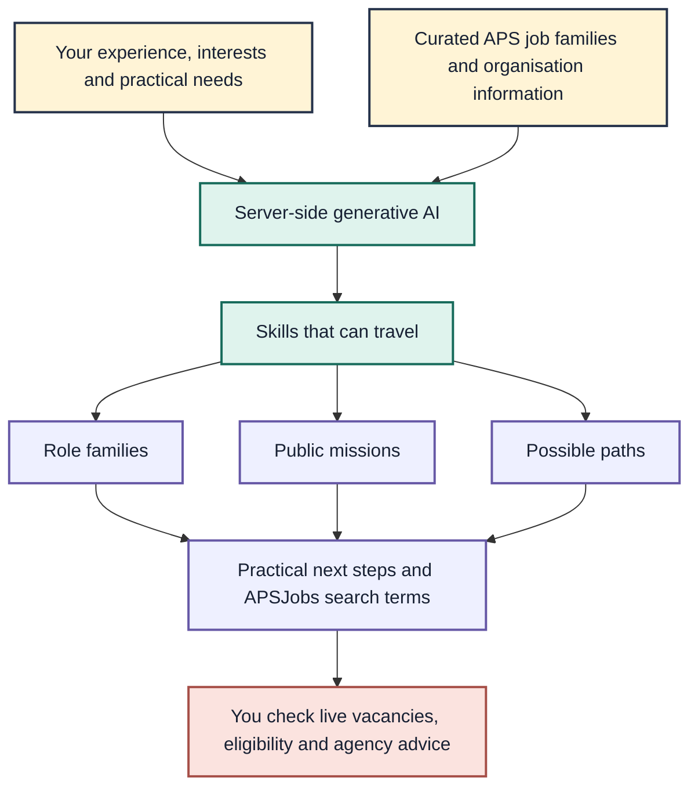
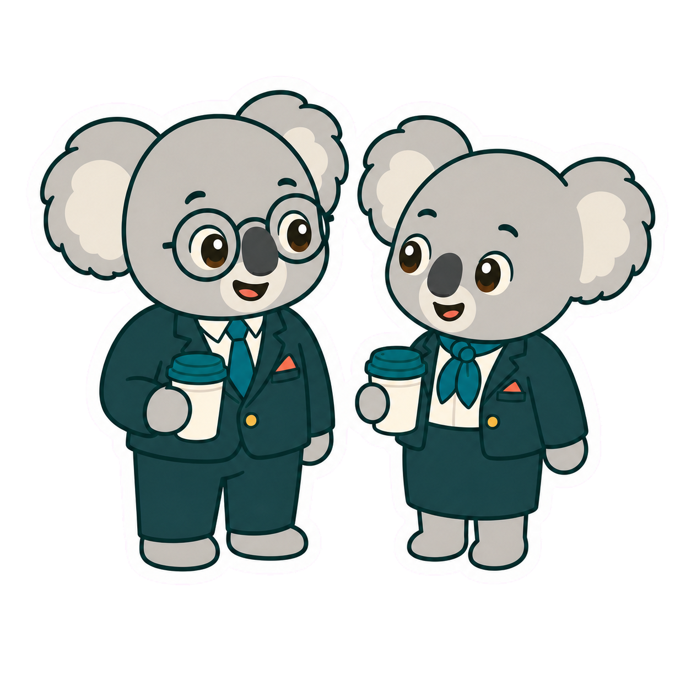
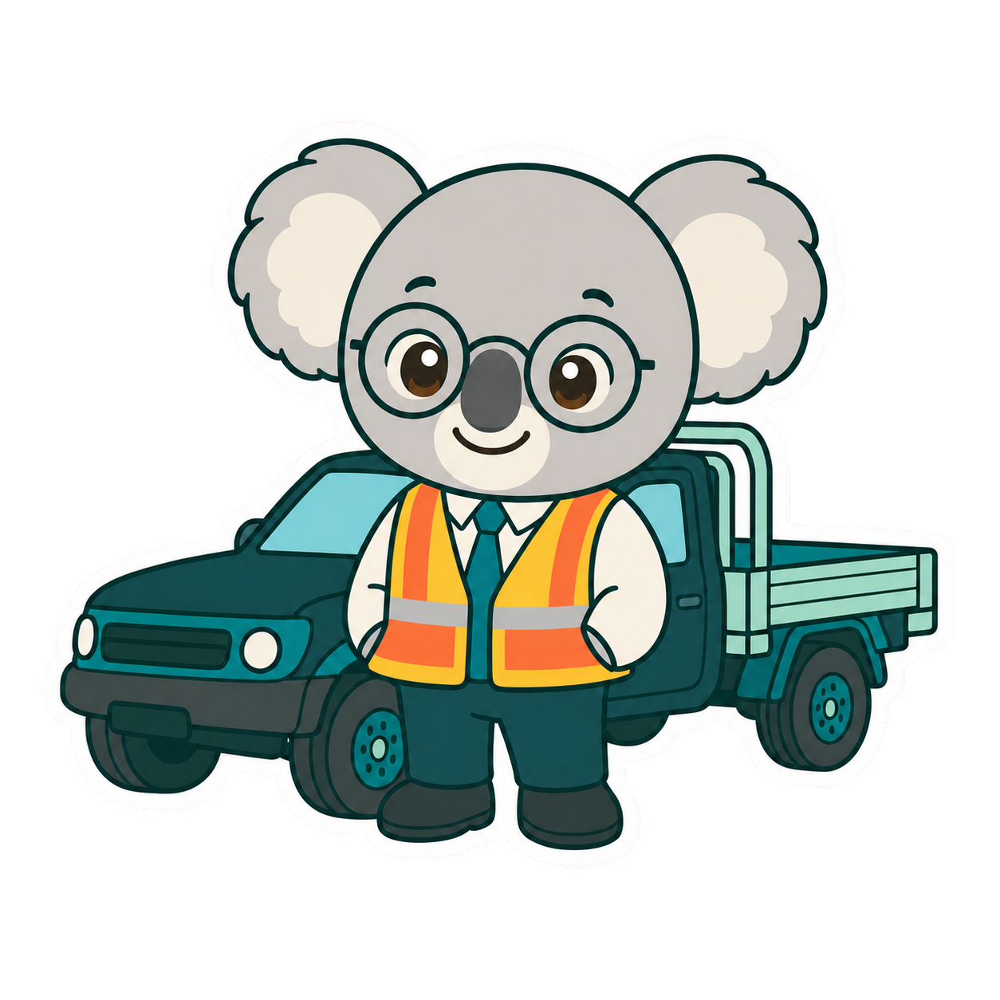

# IM2026 Service Switchboard

  

**A mobile-first career guide for finding where your skills could fit across the Australian Public Service.**

[Try the live bot](https://switchboard.bitpixi.com) · [Go to the Bot Card](https://switchboard.bitpixi.com/#bot-card)

IM2026 Service Switchboard helps current, non-ongoing and prospective public servants describe the work they can do—not just the job title they have now. Generative AI turns that information into role families, public missions, organisations to explore and practical next steps.

This is an independent prototype for the Australian Government Innovation Month bot challenge in **The Complexity Tamer** category.

## Why it fits the challenge

| What judges are looking for | How Service Switchboard responds |
|---|---|
| **Helpful and useful** | Turns a vague career question into specific role families, search terms, organisations and next steps. |
| **Interactive generative AI** | Builds a new career map from each person's experience, interests and practical needs. |
| **Clear and practical** | Uses plain language and separates ideas into **Explore now**, **Confirm first** and **Build toward**. |
| **Safe and trustworthy** | Grounds suggestions in public APS sources and tells users what a human or agency must confirm. |
| **Mobile first** | Uses large text, simple choices, touch-friendly controls and short results that work on a phone. |

## The problem

Government is large, job titles vary and transferable skills are easy to miss. A person may know they enjoy coding, design, data, field work, administration, finance, economics or cyber security without knowing which APS roles or organisations to investigate.

The bot gives them a clearer place to start. It does not decide whether they are suitable or eligible for a job.

## How it works

The response is returned as structured data so the interface can present a consistent, readable career map rather than a long block of chat text.

## A quick judge walkthrough

1. Open the [live bot](https://switchboard.bitpixi.com) on a phone or desktop.
2. Choose up to eight work areas that describe what you enjoy or can do.
3. Add a short example of your experience and any practical needs.
4. Build the switchboard to see skills that can travel, role families, public missions and possible paths.
5. Review the suggested next steps and the questions that still need an agency or recruitment contact to answer.

  

## What the bot can help with

- Spot transferable skills in plain language.
- Explore 20 work areas, including technology, cyber security, data, economics, finance, policy, service delivery, field work and administration.
- Find APS role families and useful APSJobs search terms.
- Identify Commonwealth organisations worth investigating.
- Separate options into **Explore now**, **Confirm first** and **Build toward**.
- Prepare sensible questions for a recruiter or hiring contact.

  

## Safety by design

- All generative AI requests run on the server; no service credentials are sent to the browser or committed to this public repository.
- The service asks people not to enter classified, sensitive or personal information.
- Official frameworks and a curated organisation catalogue ground the response.
- The bot does not claim a vacancy exists or make recruitment, citizenship, visa or security-clearance decisions.
- Every result tells the user what must be checked with the agency or vacancy contact.
- Input limits and structured output reduce misuse and unpredictable responses.

## A useful next step—with a real trade-off

If I extended this bot, I would explore approved APIs for live job boards and public team-lead or recruitment contact details. That could turn a broad career path into a current vacancy or a useful person to contact, making the service more actionable for career switchers.

I would not release that capability without authentication, rate limits, logging, allowlisted data sources and abuse monitoring. Bringing government roles, teams and contact details together could also make targeting or social engineering easier for hostile foreign actors. Authentication adds friction, so it is intentionally out of scope for this simple, low-friction demo.

  

## Bot Card

| | |
|---|---|
| **Purpose** | Help people see where their transferable skills could fit across the Australian Public Service. |
| **Intended users** | Current, non-ongoing and prospective public servants, including career switchers. |
| **Information used** | Skills and preferences entered by the user; the APS Job Family Framework; public organisation, citizenship and security-clearance guidance. |
| **Limitations** | It does not search live vacancies, verify facts about a person or make recruitment, visa, citizenship or clearance decisions. |
| **Risks** | Generative AI may overgeneralise experience, miss a suitable path or use information that has changed. Users must check current official advice. |
| **Tools used** | Codex Pro, OpenAI API, Next.js, Lucide icons, curated Australian Government sources and Sites hosting. |

## Ready-to-send contest email

**To:** InnovationMonth@finance.gov.au 
**Subject:** IM2026 bot challenge entry — Service Switchboard

> Hello Innovation Month team,
>
> Please accept my entry for the IM2026 bot challenge.
>
> **Bot name:** IM2026 Service Switchboard 
> **Category:** The Complexity Tamer 
> **Bot link:** https://switchboard.bitpixi.com
>
> **Short description:** IM2026 Service Switchboard is a mobile-first generative AI career guide. It helps current, non-ongoing and prospective public servants turn their skills and interests into APS role families, organisations to explore, useful search terms and practical next steps. It makes a large and unfamiliar system easier to navigate while clearly separating suggestions from decisions that must be confirmed with an agency.
>
> **Bot Card**
>
> - **Purpose:** Help people see where their transferable skills could fit across the Australian Public Service.
> - **Intended users:** Current, non-ongoing and prospective public servants, including career switchers.
> - **Information used:** User-entered skills and preferences, the APS Job Family Framework and public Australian Government information.
> - **Limitations:** The bot does not search live vacancies or make recruitment, visa, citizenship or security-clearance decisions.
> - **Risks:** Generative AI may miss a suitable path or use information that has changed. Users must check current official advice.
> - **Tools used:** Codex Pro, OpenAI API, Next.js, Lucide icons, curated Australian Government sources and Sites hosting.
>
> **Acknowledgement:** I acknowledge that this bot is my work. I used generative AI and coding assistance to build the prototype, as disclosed in the Bot Card, and I am responsible for this submission.
>
> Kind regards, 
> Kasey Robinson 
> Inclusive Strategies Census Engagement Manager 
> Australian Bureau of Statistics 
> Bendigo, Australia 
> US Citizen. Full Australian working rights. 
> Kasey.Robinson@abs.gov.au

## Information sources

- [APS Job Family Framework](https://www.apsc.gov.au/initiatives-and-programs/aps-workforce-strategy-2025/workforce-planning-resources/aps-job-family-framework)
- [Australian Government Organisations Register](https://www.directory.gov.au/reports/australian-government-organisations-register)
- [APSC citizenship guidance](https://www.apsc.gov.au/working-aps/hr-practitioners/recruitment-aps/onboarding/citizenship-aps)
- [AGSVA eligibility and suitability guidance](https://www.agsva.gov.au/applicants/eligibility-suitability)

Agency and careers links are a curated prototype snapshot. Check current official information before acting on a result.

## Contact

[Website](https://bitpixi.com) · [LinkedIn](https://linkedin.com/in/bitpixi) · [GitHub](https://github.com/bitpixi2) · [Email](mailto:Kasey.Robinson@abs.gov.au)

---

IM2026 Service Switchboard is an independent prototype. It is not an official recruitment, migration or security-clearance service.
